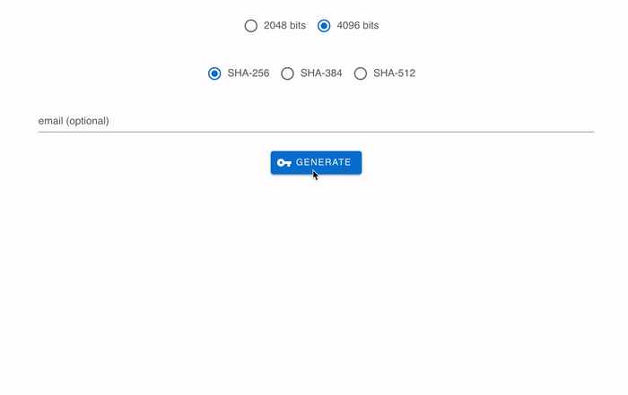

# ssh-keygen

## Application
<https://ssh-keygen.nwtgck.org>

## Thanks ❤️
The core of this project was originally created by [Patrick Roumanoff](http://blog.roumanoff.com/). Thanks! The original repository is found on [PatrickRoumanoff/js-keygen](https://github.com/PatrickRoumanoff/js-keygen).
